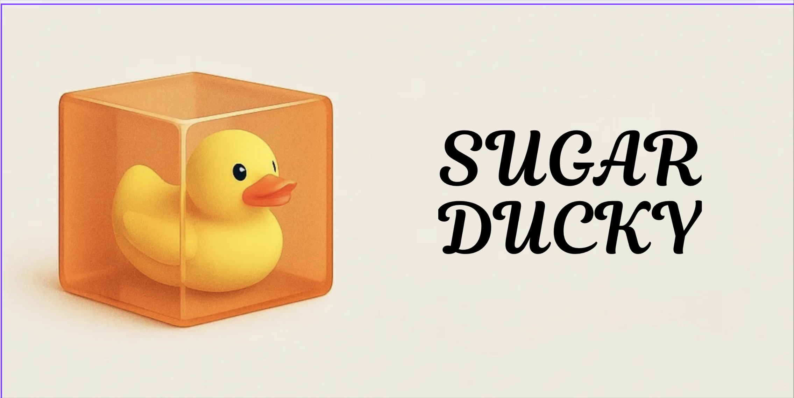
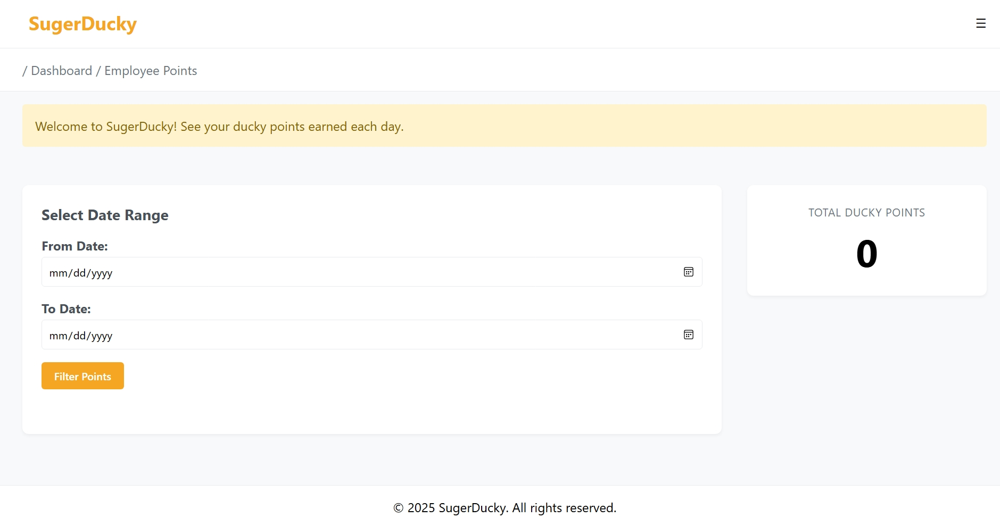

# 🦆 Sugar Ducky - Emotional Support AI Assistant



## 🏆 Hackathon Project

Sugar Ducky is an innovative AI-powered emotional support assistant and performance evaluation system that assigns **rubber ducky points** based on daily task reviews. This project combines natural language processing with a fun, gamified reward system to boost motivation and engagement in the workplace.

## 🌟 Features

- **Emotional Support Chat**: Interactive AI assistant that provides empathetic responses and emotional support
- **Department-Specific Support**: Tailored assistance for different departments (IT, Sales, Call Center)
- **Performance Analysis**: Daily task reviews with weighted scoring system
- **Points System**: Gamified approach with up to 10 duckys per day!
- **Employee Data Integration**: Secure integration with company HR systems
- **Real-time Analytics**: Track engagement and emotional well-being metrics
- **Dashboard Integration**: Ready for integration with internal tools

## 🛠️ Technology Stack

- **Frontend**: HTML, CSS, JavaScript
- **Backend**: PHP
- **AI/ML**: Python
- **Database**: MySQL
- **Containerization**: Docker

## 📁 Project Structure

```
webpage/
├── Webpage/              # Frontend assets
│   ├── API/             # Backend API endpoints
│   └── index.html       # Main application interface
├── algorithm/           # AI/ML algorithms
│   ├── call_center.py   # Call center specific AI
│   ├── it.py           # IT department AI
│   └── sales.py        # Sales department AI
├── DB/                  # Database files
│   ├── Company_HR_Employee_Data/
│   └── Sugar_Ducky_points/
└── docker-compose.yml   # Docker configuration
```

## 🧠 Scoring System

- Keywords are assigned weights from **-5 to +5**
- Remarks are scored based on presence of those keywords
- Performance is normalized across daily tasks
- Duckys are awarded in two tiers:
  - **Efficiency Duckys (0–5)**
  - **Bonus Duckys (0–5)** for positively scored tasks

## 📐 Output Sample

```json
{
  "Task_Scores": [3, 5, -11, 9, -3],
  "Efficiency_Percentage": 63.33,
  "Efficiency_Duckys": 3,
  "Task_Bonus_Duckys": 3,
  "Total_Rubber_Duckys": 6,
  "Max_Rubber_Duckys_Possible": 10,
  "Duck_Efficiency_Percentage": 60.0
}
```

## 💻 Code Showcase

### AI Scoring System
Department-specific scoring algorithms in Python:

```python
def score_call_center(calls, satisfaction):
    score = calls // 10
    if satisfaction >= 4.0:
        score += 2
    return score

def evaluate_call_center_for_date(date_to_check):
    # Database connection and points calculation
    date_str = date_to_check.strftime("%Y-%m-%d")
    # ... database operations ...
    points = score_call_center(calls, satisfaction)
    print(f"✅ Sugar Ducky points for {date_str}: {points} points")
```

### API Endpoints
RESTful API endpoints for points tracking:

```php
<?php
// Points retrieval endpoint
$query = "SELECT record_date AS date, points 
          FROM $table 
          WHERE record_date BETWEEN ? AND ? 
          ORDER BY record_date";
$stmt = $conn->prepare($query);
$stmt->bind_param("ss", $fromDate, $toDate);
$stmt->execute();
$result = $stmt->get_result();
```

## 📸 Screenshot / Demo


## 🚀 Getting Started

### Prerequisites

- Docker and Docker Compose
- PHP 7.4 or higher
- Python 3.8 or higher
- MySQL 5.7 or higher

### Installation

1. Clone the repository:
   ```bash
   git clone [repository-url]
   cd webpage
   ```

2. Start the application using Docker:
   ```bash
   docker-compose up -d
   ```

## 💡 Usage

1. Open the web interface in your browser
2. Log in with your employee credentials
3. Start chatting with Sugar Ducky
4. Earn points by engaging with the assistant
5. Track your emotional well-being progress

## 🔒 Security

- All employee data is encrypted and stored securely
- API endpoints are protected with authentication
- Regular security audits are performed
- GDPR compliant data handling


## 💡 Ideas for Extension

- Use LLMs or transformers for smarter sentiment parsing
- Add emoji reactions to reports 😂👍😡
- Tie ducky rewards to HR dashboards
- Weekly ducky leaderboard

## 📝 License

This project is licensed under the MIT License - see the LICENSE file for details.

## 👥 Team

- [Rishikesh] - Frontend Developer
- [Faizan] - Backend Developer
- [Aditya] - System Architect
- [Ishaani] - UI/UX Designer
- [Abhishek] - Project Manager
- [Vinay] - AI/ML Engineer

## 🧽 Maintainer

**Team Code Nexus**  
[Website] *([http://3.108.53.187/](https://aahassoftechsolutions.com/hack/))*


---
Made with ❤️ during [418 Hackathon]
